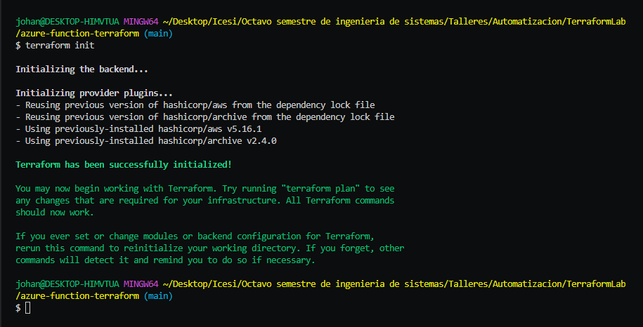
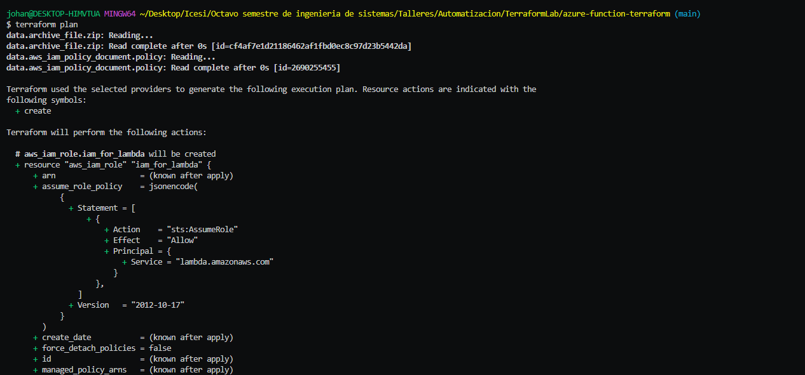
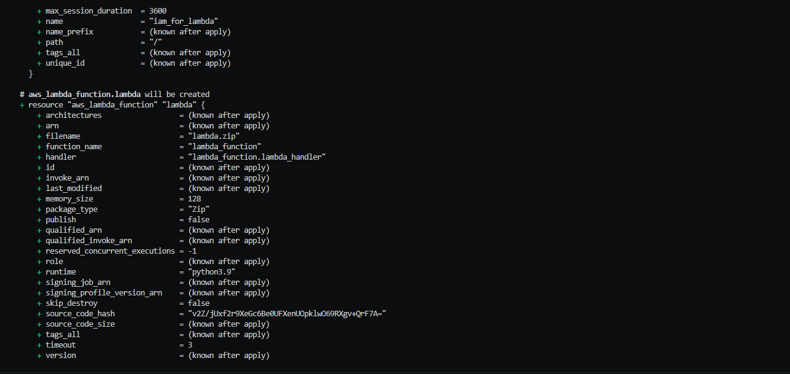
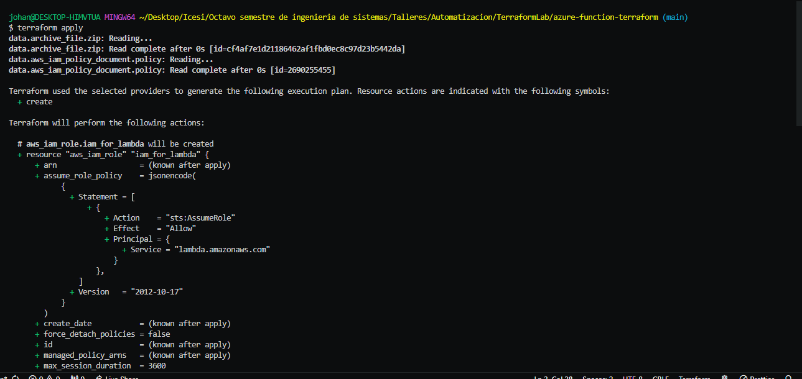
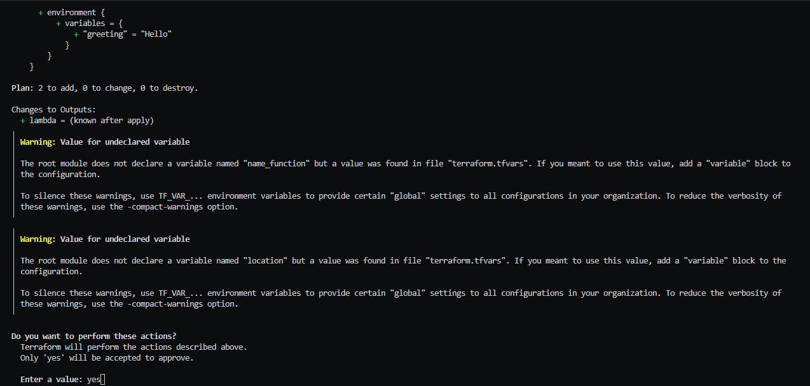
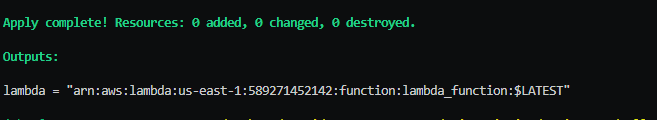
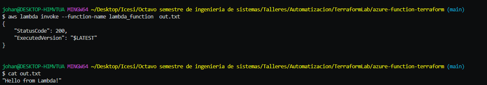

# aws lambda function terraform
In this fork you will see how to deploy a lambda function using terraform. <br>

## Configuration 👓

In order to use aws instead of azure you need to folow these steps: 
 - Install , if u dont have it yet,   aws CLI and run 
 ```bash
    aws configure
```
 then provide a new public and secret access key

- Change your provider to aws, and set your region, you can provide that configuration unsing your tfvars.
- Add your iam policy. 

## About the implementation 🎈

In this version, instead of using the file *index.js* a new file was created in order to support de lambda function. This new file was made in python called *lambda_function.py* and it looks like this
 ```python
import os
def lambda_handler(event, context):
    return "{} from Lambda!".format(os.environ['greeting'])
```

where the env varibale greeting, provided by the terraform code, is used for formatting the message.

## Testing terraform commads ⭐️

- *terraform init*



- *terraform plan*




- *terraform apply* 





## Check the function running ⛹🏾‍♂️




